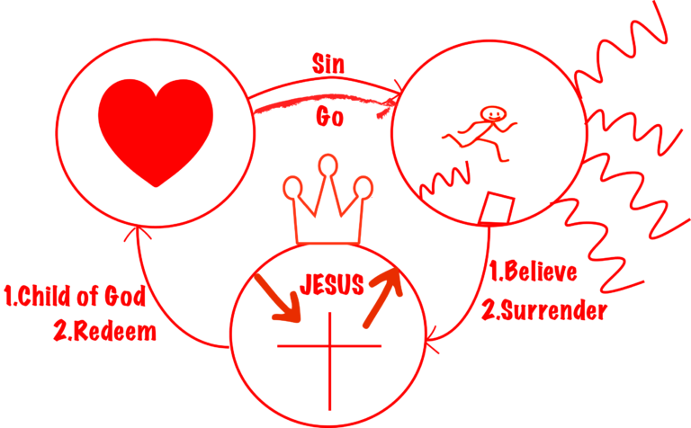

## The Gospel
Gospel of Jesus is God’s salvation plan for his children who he loves. Since all men fall short from the glory of God (Romans 3:23), we live in a broken world today. The pain, the tear, and the evil all of them are around us. However, in the beginning, God designed a perfect world for us, but because of sin, we came to this broken world to suffer, to experience the pain we deserved. Since we deeply feel our sin and shame about them, we are trying to do things to escape our sins. For instance, drugs, alcohol, and immortal sexual relationship.  What Jesus said about these things we are doing, the result are death and destruction (2 Thessalonians 1:9).

However, God loves you so much, he still wants you go back to live with him again. 2000 years ago, he send his only son Jesus came to the earth to died for your sins on the cross, and raised again after three days. (John 3:16)

God made a promise to all of us that if we believe in his son Jesus and surrender our life to him, we will be saved and have eternal life. (1 John 5:13) We will be the children of his kingdom. (Romans 8: 14-17)   Your salvation depends on God’s grace alone, and it does not have anything to do with your works. (Ephesian 2:8-9)

Once we become disciples of Jesus, he also commanded us go to make more disciples, share the love of him. End of the age is coming, time is near! (Matthew 28:18-20)
